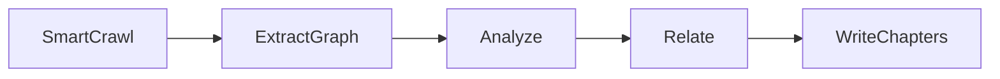

# Crack

Crack runs analyses on a codebase and generates written overviews: multi-chapter tours with diagrams and cross-references, request-flow summaries across server-side layers, a map of the services a system runs and rents, a guide to a product's API surface, a tour of the data model and the migrations that shaped it, or the product's story read out of its git log. Point it at a repo and get HTML/Markdown pages explaining how the code works.

## What this ships

Seven analyses, each implemented as a [PocketFlow](https://github.com/The-Pocket/PocketFlow) workflow:

### Tour

A five-stage pipeline (SmartCrawl, ExtractGraph, Analyze, Relate, WriteChapters):

- [`src/crack/analyses/tour/`](src/crack/analyses/tour/) -- the multi-chapter analysis. SmartCrawl, Analyze, and Relate parse structured YAML output and retry on a bad response (`crack.core.yaml_call`); WriteChapters calls the LLM directly and retries via PocketFlow's own `Node(max_retries=3)`.
- [`src/crack/analyses/tour/prompts/`](src/crack/analyses/tour/prompts/) -- the prompt template each stage sends to the LLM, one file per stage.
- [`src/crack/analyses/tour/instructions/`](src/crack/analyses/tour/instructions/) -- four swappable output styles (see "Swap the output style" below). Same pipeline, different framing for the same chapters.
- [`skill/CODEBASE-TOUR.md`](skill/CODEBASE-TOUR.md) -- the analysis packaged as an agent skill.

### Backend

A five-stage pipeline (BuildBundle, Pipeline, LayerCode, Trace, OverviewNode) that maps a server-side backend into six layers (route, middleware, handler, service, database, response) and shows the request flow through them:

- Builds a bundle describing the repository structure at each layer.
- Renders three views: the pipeline with a file count per layer, code snippets showing how each layer connects to the others, and a trace of a single request through all six layers.
- Expects a server-side backend (Django, Express, Rails, FastAPI, and similar frameworks). Works best on backends with clear separation of concerns. Pointed at a repository with none, the run stops before it spends an LLM call.
- Known limitation, worth reading before you spend a run:
  - A flat Django app is read incompletely: `views.py` is not recognised, so the handler layer reports zero even though the routes and models are found.

### Architecture

A five-stage pipeline (BuildBundle, Inventory, TechStack, TraceRequest, OverviewNode) that maps a multi-service system: the programs it runs, the services it rents, and the wires between them:

- Overlays four sources that no single file holds together: process declarations (compose, Kubernetes manifests, `Procfile`, platform config), environment variable names from `.env` files, the union of `package.json` dependencies, and Terraform. `git grep` reports which files import which SDK, as proof a connection is live rather than merely configured -- the file and the SDK name only, never the source line, since a matched constructor can hold a hardcoded token. Credential values are stripped before the bundle leaves the machine, including Kubernetes `name`/`value` env pairs, and a bundle that hit its size cap says so rather than stopping mid-file.
- Renders three views: every node sorted into four bands (run, rent, call, client), the real technology behind each box's label, and one request traced hop by hop with its variants.
- Expects a multi-service application. The run stops before it spends an LLM call only when the whole bundle is empty; a repo with no config files but some dependencies or SDK imports still proceeds, which is how the CDK case below reports `0 config files` and carries on.
- Known limitations, worth reading before you spend a run:
  - Infrastructure written in a general-purpose language is invisible. AWS CDK and Pulumi stacks are ordinary `.ts`/`.py` programs, and SAM `template.yaml` is an ordinary YAML file, so none of them are classified. A CDK repository reports `0 config files` while its stacks sit in `infra/lib/`. Tracked as `coderay-q2r.10`.
  - Credential values are stripped from the bundle before it is sent, by key name (`password`, `token`, `secret`, and similar), by connection-string position (`postgres://user:pw@host`), and for every value under a Kubernetes `Secret`. Names, service topology, images and ports survive. This is a redactor, not a secret scanner: a credential under an unguessable key name in a file that is not a `Secret` can still get through, so treat the bundle as sensitive.
  - Outside a git checkout, `git grep` fails and the SDK import lines are silently empty, so a tarball export loses the evidence that a connection is live and the report is built on configuration alone. Tracked as `coderay-q2r.15`.

### Interfaces

A five-stage pipeline (FindRoutes, ApiMenu, TraceActions, EndpointSequence, OverviewNode) that reads a product's API surface at three levels of zoom:

- Collects the files that declare entry points by framework convention: Rails `config/routes.rb`, Django `urls.py`, Express and Fastify routers, Next.js `pages/api/` and `app/**/route.ts`, tRPC, GraphQL and gRPC schemas, and Go `cmd/`. Manifests and aggregators are read first, so a size cap trims single handlers rather than the map.
- Renders four views: every endpoint grouped by feature and sized against the biggest group, a short tour of the groups that say the most about the product, one user gesture traced across service lanes, and a message-by-message sequence diagram of a single endpoint. The tour is omitted rather than rendered empty when the model writes none.
- Expects a web API. Pointed at a repository with no surface files, the run stops before it spends an LLM call.
- Known limitation, worth reading before you spend a run:
  - When the model's endpoint pick cannot be read, the sequence diagram falls back to the largest route file, preferring a Next.js `pages/api/` handler where there is one. If nothing readable is left, the diagram is written from the route list alone and its `file:line` references are the model's inference; the card says so in that case rather than reading like a grounded one.

### Schema

A six-stage pipeline (FindSchema, SchemaTour, TraceFlows, TableDeepDive, MigrationActs, OverviewNode) that reads a database schema as a map of the business:

- Finds the schema by convention in priority order: Prisma `schema.prisma`, Rails `db/schema.rb`, a dumped `schema.sql`, or the Django and SQLAlchemy `models.py` files concatenated. `--schema path/to/file` overrides the search. The schema goes into every deep-dive batch, so a total size budget caps how many files are included and records when it truncated.
- Renders four views: the schema told as a story with an ER diagram, one user action traced across tables, the columns and indexes of the core tables, and the migration history clustered into product eras.
- The deep dive reviews four tables per LLM call rather than all at once, which is why this analysis does not raise the output-token ceiling the way the others do.
- The migration section is skipped, with a note saying so, when fewer than four migrations are found. That is a real finding about the repository rather than a gap in the report, so it stays on the page.
- Expects a schema. Pointed at a repository with none, the run stops before it spends an LLM call and tells you to try `--schema`.

### Git history

A five-stage pipeline (FetchHistory, NameEras, ProfileEras, Graveyard, OverviewNode) that reads a product's story out of its commit log:

- Compresses the whole history into a directory-by-month survey, then asks the model to name three to five eras from it. Each era is then profiled one at a time, in order, so a later era can be contrasted with the ones before it.
- The graveyard reads the biggest deletions -- the features the team built and later removed -- skipping vendored and build churn so `node_modules/` does not bury the real ones. `--max-graves` and `--grave-min-files` tune it.
- Builds its page from structured data rather than markdown blobs, so it ships its own renderer instead of the shared card engine.
- Needs a git checkout. Pointed at a directory that is not one, `git log` fails and the run stops with git's own message.

### Product intent

A five-stage pipeline (FetchRepo, PainScene, VariantSentence, CompetitivePositioning, SurprisesAndAbsences) that reverse-engineers the product story from the source:

- Writes the pain scene a user is in before the product exists, and the one-sentence "It's X, but Y" variant that passes the reproduce-it test.
- Positions the product against its real competitors in a side-by-side table, with what it gives up, what it gets, and why incumbents cannot copy the move.
- Lists what is surprisingly present in the code and what is missing on purpose, each read as a bet.
- `--include` and `--exclude` take `.gitignore`-style patterns to narrow the crawl. The crawl keeps whole files until a fixed budget is spent and says how many it dropped.
- Ships its own renderer, like git-history. Text-only: the port source's generated illustration is not included.

### A note on what leaves your machine

Every analysis sends repository content to an LLM provider. Three rules hold across all of them:

- Files discovered by the crawl are read only if they resolve inside the target repository, so a checked-in symlink pointing at `~/.aws/credentials` is refused rather than read.
- `product-intent` sends whole source files to the model, up to a fixed budget, in directory order rather than by LLM selection as the tour does. The crawler's skip list applies, so credential-named files (`.env*`, `*.pem`, `secrets.yml` and the rest) are never read; a key pasted inline in `config.py` still goes.
- `git-history` sends commit diffs to the model. The body of a credential-bearing file (`.env*`, `*.pem`, `terraform.tfvars` and the rest of the crawler's skip list) is stripped from those diffs first, while its path and the `--stat` line stay, since a secret being deleted is itself worth reporting.
- The `architecture` bundle strips credential values by key name, by position in a connection string, from Kubernetes `name`/`value` env pairs, and from every value in a Kubernetes `Secret`. This is a redactor, not a secret scanner: a credential under an unguessable key name in a file that is not a `Secret` can still get through.
- `crack schema --schema <path>` is exempt from the containment rule, because that path is yours rather than the repository's.

## Quickstart

```bash
pip install -e .            # or: pip install -e ".[openai,gemini]" for those providers
cp .env.example .env        # fill in the one key you need, see .env.example for all options
export GEMINI_API_KEY=...   # or ANTHROPIC_API_KEY / OPENAI_API_KEY

crack tour path/to/repo     # multi-chapter codebase tour
# OR
crack backend path/to/repo  # server-side backend flow analysis
# OR
crack architecture path/to/repo  # multi-service architecture map
# OR
crack interfaces path/to/repo  # API surface and endpoint sequence
# OR
crack schema path/to/repo     # data model and migration history
# OR
crack git-history path/to/repo  # the product story in the commit log
# OR
crack product-intent path/to/repo  # the product story in the source
```

If a **tour** run fails partway through (a bad LLM response after retries, a network error), the files, abstractions, and chapters completed so far are written to `run_state.json` in the target output directory, so you can see how far it got without rerunning the whole pipeline. The other analyses do not do this: a failed run leaves an empty output directory.

Example output:

```bash
  Selected 20 files (280,023 chars)
  Found 8 abstractions
  Found 13 relationships
  Chapter 1/8: Tokenizer
  Chapter 2/8: GPT
  Chapter 3/8: COMPUTE_DTYPE
  ...

Wrote tour to ../output/nanochat-beginner-tutorial-tour/
  Open ../output/nanochat-beginner-tutorial-tour/index.html in a browser
```

The output directory name includes the repo name and the output style, so running the same repo with a different `--instructions` value writes to a separate directory instead of overwriting the previous run:

```text
output/nanochat-beginner-tutorial-tour/
├── index.md            # mermaid diagram + chapter links
├── index.html          # same, browser ready, links to chapter HTML
├── 01_tokenizer.md     # plus 01_tokenizer.html
├── 02_gpt.md           # plus 02_gpt.html
├── 03_compute_dtype.md
└── ...
```

## Swap the output style

Same pipeline and code, driven by a different file under `src/crack/analyses/tour/instructions/`. Set `--instructions` to change what the chapters focus on:

```bash
crack tour path/to/repo --instructions architecture-review
crack tour path/to/repo --instructions security-audit
crack tour path/to/repo --instructions onboarding-guide
```

| Style                         | What you get                                                                     |
| ----------------------------- | -------------------------------------------------------------------------------- |
| `beginner-tutorial` (default) | Analogies, code blocks under 10 lines, plain explanations of what each part does |
| `architecture-review`         | Design decisions, alternatives considered, failure modes, technical debt         |
| `security-audit`              | Trust boundaries, input validation gaps, blast radius of a compromise            |
| `onboarding-guide`            | A first-week checklist: what to touch, what to avoid, real shell commands        |

## Estimate cost before you run it

```bash
crack tour path/to/repo --dry-run
```

`--dry-run` makes no network calls, needs no API key, and writes nothing to disk. It estimates the size of the prompts a real run would send (file selection, abstraction analysis, relationships, and one chapter prompt repeated for an estimated chapter count) and prints a cost range:

```text
Estimated cost (dry run)
Assumes ~8 chapters (actual count depends on the repo)
Estimated cost:  $0.0123 - $0.1456
Estimated usage: ~12345 input tokens, up to ~131072 output tokens
Note: this estimate does not account for prompt caching -- a real run
reuses the same codebase block across calls, so actual cost is often
lower than the low end shown here.
```

The low end of the range assumes zero output tokens; the high end assumes every call hits the configured max-output limit. Treat the high end as a worst case, not a typical cost. If the selected model has no pricing entry, the range shows `unknown (no pricing for this model)` instead of a number.

The estimate also can't account for prompt caching, since it never makes a real LLM call. A real run reuses the same codebase text across the Analyze, Relate, and WriteChapters calls, so part of what the estimate treats as full-price input ends up billed as cheaper cache reads. On a repo where caching kicks in heavily, the actual cost reported after a real run can come in below this estimate's low end.

A real run (without `--dry-run`) prints a `Session` summary at the end with the actual token counts and cost, based on the usage each LLM call reported.

### Pricing overrides

Built-in pricing covers the default model for each provider. For any other model, crack prompts you once, interactively, for $/1M token pricing, and saves it to `~/.config/crack/pricing.json`. That file is yours to edit directly; an entry there always takes priority over the built-in pricing table. Format:

```json
{
  "openai:gpt-6-preview": {
    "input": 3.0,
    "output": 15.0,
    "cache_read": 0.3,
    "cache_write": 0.0
  }
}
```

## How it works



1. **SmartCrawl.** Two phases. First, filter files by extension and skip obvious noise (`tests/`, `docs/`, lock files, anything over 500 KB). Then build a preview manifest — the first few hundred characters of each remaining file — and ask the LLM to select the roughly 0.1-2% of files that matter most, using the selection rules in [`src/crack/analyses/tour/prompts/select-files.md`](src/crack/analyses/tour/prompts/select-files.md).
2. **ExtractGraph.** No LLM call — deterministically parses each selected file's imports (Python/JS/TS) into `symbol_graph`, the edges Relate later checks against.
3. **Analyze.** One LLM call. Returns a YAML list of 5-10 abstractions, each with a short description, plus a suggested learning order.
4. **Relate.** One LLM call. Returns the relationships (edges) between those abstractions, each tagged `EXTRACTED` (backed by a real import edge between the abstractions' files, Python/JS/TS only) or `INFERRED` (LLM judgment). The mermaid diagram in `index.html` draws `EXTRACTED` edges solid, `INFERRED` edges dashed.
5. **WriteChapters.** Not batched. Writes chapters one at a time, in learning order, passing every previously written chapter forward as context. This keeps the chapters consistent with each other instead of reading like unrelated pages.

WriteChapters runs sequentially on purpose: running it in parallel would lose the cross-chapter context that keeps the tour coherent.

## Example output

One real tour, generated end to end against [karpathy/micrograd](https://github.com/karpathy/micrograd) (`output/` is gitignored, so this isn't checked in — run the quickstart above to generate your own):

| Tour             | Files selected | Chars selected | Abstractions | Relationships | Chapters |
| ---------------- | -------------- | -------------- | ------------ | ------------- | -------- |
| `micrograd-tour` | 3              | 7,784          | 10           | 12            | 10       |

Each tour contains one Markdown and one HTML file per abstraction, plus an `index.html` with the architecture diagram and chapter list. The chapter HTML pages render code blocks, tables, and Mermaid diagrams.

## Development

```bash
pip install -e .
python -m pytest tests/ -v
```

CI (`.github/workflows/tests.yml`) runs the same test suite on every push and pull request.
