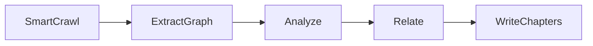

# Crack

Crack runs analyses on a codebase and generates written overviews: multi-chapter tours with diagrams and cross-references, request-flow summaries across server-side layers, or a map of the services a system runs and rents. Point it at a repo and get HTML/Markdown pages explaining how the code works.

## What this ships

Three analyses, each implemented as a [PocketFlow](https://github.com/The-Pocket/PocketFlow) workflow:

### Tour

A five-stage pipeline (SmartCrawl, ExtractGraph, Analyze, Relate, WriteChapters):

- [`src/crack/analyses/tour/`](src/crack/analyses/tour/) -- the multi-chapter analysis. SmartCrawl, Analyze, and Relate parse structured YAML output and retry on a bad response (`crack.core.yaml_call`); WriteChapters calls the LLM directly and retries via PocketFlow's own `Node(max_retries=3)`.
- [`src/crack/analyses/tour/prompts/`](src/crack/analyses/tour/prompts/) -- the prompt template each stage sends to the LLM, one file per stage.
- [`src/crack/analyses/tour/instructions/`](src/crack/analyses/tour/instructions/) -- four swappable output styles (see "Swap the output style" below). Same pipeline, different framing for the same chapters.
- [`skill/CODEBASE-TOUR.md`](skill/CODEBASE-TOUR.md) -- the analysis packaged as an agent skill.

### Backend

A five-stage pipeline (BuildBundle, Pipeline, LayerCode, Trace, OverviewNode) that maps a server-side backend into six layers (route, middleware, handler, service, database, response) and shows the request flow through them:

- Builds a bundle describing the repository structure at each layer.
- Renders three views: the pipeline with a file count per layer, code snippets showing how each layer connects to the others, and a trace of a single request through all six layers.
- Expects a server-side backend (Django, Express, Rails, FastAPI, and similar frameworks). Works best on backends with clear separation of concerns.
- Known limitations, worth reading before you spend a run:
  - Pointed at a repository with no server-side backend, it does not stop. It spends all three LLM calls and writes a report invented from an empty bundle, with no warning and no error. Check the layer counts it prints after the crawl before trusting the output.
  - A layer directory at the repository root (`pages/api/` in some Next.js layouts, `routes/` in some Express layouts) is not classified, so those files are skipped and the layer reports zero.
  - A flat Django app is affected too: `views.py` is not recognised, so the handler layer reports zero even though the routes and models are found.

### Architecture

A five-stage pipeline (BuildBundle, Inventory, TechStack, TraceRequest, OverviewNode) that maps a multi-service system: the programs it runs, the services it rents, and the wires between them:

- Overlays four sources that no single file holds together: process declarations (compose, Kubernetes manifests, `Procfile`, platform config), environment variable names from `.env` files, the union of `package.json` dependencies, and Terraform. SDK `import` lines found by `git grep` are the proof a connection is live rather than merely configured.
- Renders three views: every node sorted into four bands (run, rent, call, client), the real technology behind each box's label, and one request traced hop by hop with its variants.
- Expects a multi-service application. Pointed at a repository with none of those sources, the run stops before it spends an LLM call.
- Known limitations, worth reading before you spend a run:
  - Infrastructure written in a general-purpose language is invisible. AWS CDK and Pulumi stacks are ordinary `.ts`/`.py` programs, and SAM `template.yaml` is an ordinary YAML file, so none of them are classified. A CDK repository reports `0 config files` while its stacks sit in `infra/lib/`. Tracked as `coderay-q2r.10`.
  - A manifest directory at the repository root (`k8s/`, `manifests/`, `charts/`) is not classified, though the same directory one level down is. This is the same root-directory blind spot the backend analysis has.
  - **Secret values can reach the LLM.** Only `.env` files are reduced to variable names. Compose files, Kubernetes manifests, `.tfvars`, and platform config such as `fly.toml` are sent whole, values included, even though the bundle header claims otherwise. A database password in a compose `environment:` block or a committed `.tfvars` leaves your machine. Check what those files hold before pointing this at a repository. Tracked as `coderay-q2r.14`.
  - Outside a git checkout, `git grep` fails and the SDK import lines are silently empty, so a tarball export loses the evidence that a connection is live and the report is built on configuration alone. Tracked as `coderay-q2r.15`.

## Quickstart

```bash
pip install -e .            # or: pip install -e ".[openai,gemini]" for those providers
cp .env.example .env        # fill in the one key you need, see .env.example for all options
export GEMINI_API_KEY=...   # or ANTHROPIC_API_KEY / OPENAI_API_KEY

crack tour path/to/repo     # multi-chapter codebase tour
# OR
crack backend path/to/repo  # server-side backend flow analysis
# OR
crack architecture path/to/repo  # multi-service architecture map
```

If a **tour** run fails partway through (a bad LLM response after retries, a network error), the files, abstractions, and chapters completed so far are written to `run_state.json` in the target output directory, so you can see how far it got without rerunning the whole pipeline. The `backend` and `architecture` analyses do not do this: a failed run leaves an empty output directory.

Example output:

```bash
  Selected 20 files (280,023 chars)
  Found 8 abstractions
  Found 13 relationships
  Chapter 1/8: Tokenizer
  Chapter 2/8: GPT
  Chapter 3/8: COMPUTE_DTYPE
  ...

Wrote tour to ../output/nanochat-beginner-tutorial-tour/
  Open ../output/nanochat-beginner-tutorial-tour/index.html in a browser
```

The output directory name includes the repo name and the output style, so running the same repo with a different `--instructions` value writes to a separate directory instead of overwriting the previous run:

```text
output/nanochat-beginner-tutorial-tour/
├── index.md            # mermaid diagram + chapter links
├── index.html          # same, browser ready, links to chapter HTML
├── 01_tokenizer.md     # plus 01_tokenizer.html
├── 02_gpt.md           # plus 02_gpt.html
├── 03_compute_dtype.md
└── ...
```

## Swap the output style

Same pipeline and code, driven by a different file under `src/crack/analyses/tour/instructions/`. Set `--instructions` to change what the chapters focus on:

```bash
crack tour path/to/repo --instructions architecture-review
crack tour path/to/repo --instructions security-audit
crack tour path/to/repo --instructions onboarding-guide
```

| Style                         | What you get                                                                     |
| ----------------------------- | -------------------------------------------------------------------------------- |
| `beginner-tutorial` (default) | Analogies, code blocks under 10 lines, plain explanations of what each part does |
| `architecture-review`         | Design decisions, alternatives considered, failure modes, technical debt         |
| `security-audit`              | Trust boundaries, input validation gaps, blast radius of a compromise            |
| `onboarding-guide`            | A first-week checklist: what to touch, what to avoid, real shell commands        |

## Estimate cost before you run it

```bash
crack tour path/to/repo --dry-run
```

`--dry-run` makes no network calls, needs no API key, and writes nothing to disk. It estimates the size of the prompts a real run would send (file selection, abstraction analysis, relationships, and one chapter prompt repeated for an estimated chapter count) and prints a cost range:

```text
Estimated cost (dry run)
Assumes ~8 chapters (actual count depends on the repo)
Estimated cost:  $0.0123 - $0.1456
Estimated usage: ~12345 input tokens, up to ~131072 output tokens
Note: this estimate does not account for prompt caching -- a real run
reuses the same codebase block across calls, so actual cost is often
lower than the low end shown here.
```

The low end of the range assumes zero output tokens; the high end assumes every call hits the configured max-output limit. Treat the high end as a worst case, not a typical cost. If the selected model has no pricing entry, the range shows `unknown (no pricing for this model)` instead of a number.

The estimate also can't account for prompt caching, since it never makes a real LLM call. A real run reuses the same codebase text across the Analyze, Relate, and WriteChapters calls, so part of what the estimate treats as full-price input ends up billed as cheaper cache reads. On a repo where caching kicks in heavily, the actual cost reported after a real run can come in below this estimate's low end.

A real run (without `--dry-run`) prints a `Session` summary at the end with the actual token counts and cost, based on the usage each LLM call reported.

### Pricing overrides

Built-in pricing covers the default model for each provider. For any other model, crack prompts you once, interactively, for $/1M token pricing, and saves it to `~/.config/crack/pricing.json`. That file is yours to edit directly; an entry there always takes priority over the built-in pricing table. Format:

```json
{
  "openai:gpt-6-preview": {
    "input": 3.0,
    "output": 15.0,
    "cache_read": 0.3,
    "cache_write": 0.0
  }
}
```

## How it works



1. **SmartCrawl.** Two phases. First, filter files by extension and skip obvious noise (`tests/`, `docs/`, lock files, anything over 500 KB). Then build a preview manifest — the first few hundred characters of each remaining file — and ask the LLM to select the roughly 0.1-2% of files that matter most, using the selection rules in [`src/crack/analyses/tour/prompts/select-files.md`](src/crack/analyses/tour/prompts/select-files.md).
2. **ExtractGraph.** No LLM call — deterministically parses each selected file's imports (Python/JS/TS) into `symbol_graph`, the edges Relate later checks against.
3. **Analyze.** One LLM call. Returns a YAML list of 5-10 abstractions, each with a short description, plus a suggested learning order.
4. **Relate.** One LLM call. Returns the relationships (edges) between those abstractions, each tagged `EXTRACTED` (backed by a real import edge between the abstractions' files, Python/JS/TS only) or `INFERRED` (LLM judgment). The mermaid diagram in `index.html` draws `EXTRACTED` edges solid, `INFERRED` edges dashed.
5. **WriteChapters.** Not batched. Writes chapters one at a time, in learning order, passing every previously written chapter forward as context. This keeps the chapters consistent with each other instead of reading like unrelated pages.

WriteChapters runs sequentially on purpose: running it in parallel would lose the cross-chapter context that keeps the tour coherent.

## Example output

One real tour, generated end to end against [karpathy/micrograd](https://github.com/karpathy/micrograd) (`output/` is gitignored, so this isn't checked in — run the quickstart above to generate your own):

| Tour             | Files selected | Chars selected | Abstractions | Relationships | Chapters |
| ---------------- | -------------- | -------------- | ------------ | ------------- | -------- |
| `micrograd-tour` | 3              | 7,784          | 10           | 12            | 10       |

Each tour contains one Markdown and one HTML file per abstraction, plus an `index.html` with the architecture diagram and chapter list. The chapter HTML pages render code blocks, tables, and Mermaid diagrams.

## Development

```bash
pip install -e .
python -m pytest tests/ -v
```

CI (`.github/workflows/tests.yml`) runs the same test suite on every push and pull request.
