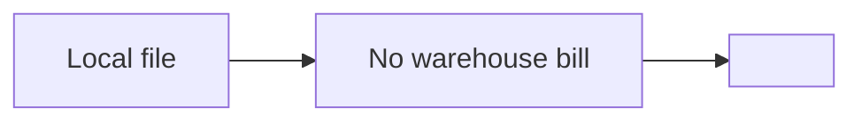

# toy_repo

_A product story reverse engineered from the codebase._

## The pitch

> It's Google Analytics, but every chart is a saved SQL query you can read. <b onmouseover=alert(1)>hover</b>

## The pain

> You're debugging why signups dropped, but the numbers live in three tabs. Your real competitor is Alt-Tab. 

## Where it sits

### What it gives up

- No hosted version.
- No real-time dashboards.

### What it gets in return

- Every number is auditable.
- Works on a plane.

### Why incumbents can't copy this

A hosted analytics vendor sells the warehouse. Shipping a local file would give away the thing they bill for.

Their sales motion depends on seat counts, and a single file has no seats.

### Side by side

**Dimensions**

- **Readable queries**: Can a user see the SQL behind a chart?
- **Source **: Is the code public?
- **Where data lives**: Whose disk holds the events?

| Product | Readable queries | Source  | Where data lives |
| --- | --- | --- | --- |
| **toy_repo** | **Yes**. Charts are SQL you can open. | **Open**. MIT, single binary. | **One file**. A SQLite database on your laptop. |
| **Mixpanel ** | **No**. Charts are a proprietary query builder. | **Closed**. SaaS only. | **Whole service**. Their warehouse, their schema. |

## Hiding in the code

### A query planner explainer
_src/explain.py_

The product is betting that users want to understand their numbers, not just see them.

### Offline-first sync
_src/sync/_

Analysts work on planes more than vendors think.

## Missing on purpose

### No user accounts
_no users table, no session middleware, no login route_

Stays a personal tool. Risk: a team cannot share a dashboard without sharing the file.
