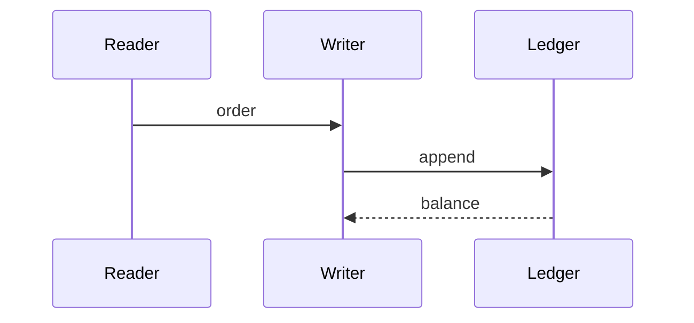

# Ledger writer

The writer appends each order to the ledger and returns the new balance.



```go
func Append(l *Ledger, o Order) (int64, error) {
	return l.rows.Insert(o)
}
```

Back to [Queue reader](01_queue_reader.md).
