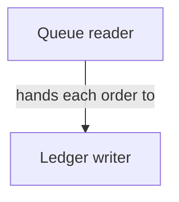

# toy_repo 

_Lens: beginner-tutorial_

_Generated 2026-01-01 from a snapshot of the code. May not reflect later changes._

A small service that reads orders off a queue and writes them to a ledger.

## Architecture

_Solid arrows are backed by a real import between the files each abstraction claims; dashed arrows are the model's judgment._

## Chapters

- [Queue  reader](01_queue_reader.md)
- [Ledger  writer](02_ledger_writer.md)